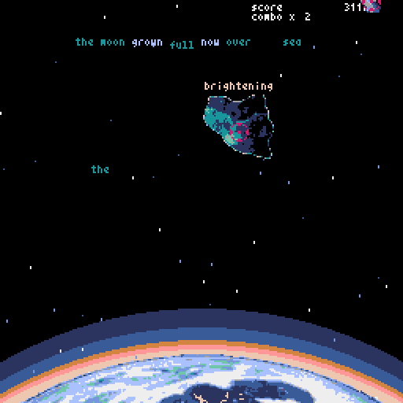

Type Me To The Moon
===================

"The moon is collapsing and threatens the earth.
Use your more poetic instincts to type your way
through the meteors and save humanity !"


Type Me To The Moon is a typing shmup developed for the
Github/itch.io game jam of november 2020 and a
first attempt at game programming.

<a href="/images/demo" target="_blank">

</a>

You'll have to install <a href="https://github.com/kitao/pyxel">**Pyxel**</a> and **SDL2** to run the game.

```sh
sudo apt install python3 python3-pip libsdl2-dev libsdl2-image-dev gifsicle
sudo -H pip3 install -U pyxel
```


